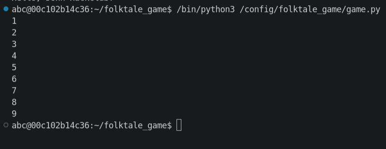

# Coding in Python Basics

Computers like following instructions. As such, this is the way programming languages like Python are designed: series
of instructions.

In Python, each new line is a new instruction. We'll look at a few of these instructions; the ones that are needed to
make your branching story game.

Let's break down the code that you typed out in the last section.

```python
print("Hello, world!")
```

There's only one instruction here - the `print` instruction. In Python, this prints out whatever text you feed in. But
what are all these weird parentheses and quotes doing here?

The fancy word for these is *parameters*. When you call `print`, Python needs to know what to print. There are a ton of
cases where one of these instructions takes in parameters, and the parentheses tell the Python interpreter that
everything contained within them are parameters for that particular instruction.

If we had two of them:

```python
print("Line 1")
print("Line 2")
```

The parentheses of the first instruction here grabs "Line 1" for itself, and "Line 2" is its own thing for the next
instruction. If you run this code, you'll see that two separate lines get printed out, one for each of the instructions.

Quick vocabulary nibble, "instruction" is technically the wrong word to use here. I was using it since I think it
conveys the message better, but I will be calling these types of lines of code by the more accurate term "function" from
here on out.

Looping back to those `print` functions there, I never went over what the quotes mean. Whenever you see quotes (single
and double quotes are equivalent in Python), that means everything inside them is treated as one big chunk of text. If
you didn't have them, the Python interpreter might not be sure if this is all part of one parameter or that it's not
text at all.

That last part is important. Let's say we had this bit of code here:

```python
print(1 + 2)
print("1" + "2")
```

The first one treats the two as numbers, adds them like numbers, and prints out `3`.

In Python, `+` adds numbers, `-` subtracts them, `*` (not `x`) multiplies, and `/` divides.

The second one treats the two as text instead of numbers, "adds" them by sticking one on the end of the other, and will
print out `12`.

So we've learned a fair bit about printing this out for the user, but to make a branching story game, you'll need to be
able to ask the user for input. We use another function for this, fittingly named the `input` function.

For a simple example, let's print out a simple greeting for the user.

First, here's some code that will greet anyone named Bob.

```python
print("Hello, " + "Bob" + "!")
```

We're using the same adding text together trick as before, so we can separate the name of the person that we're greeting
from everything else in our message. Now though, let's replace "Bob" with the input function.

```python
print("Hello, " + input("What's your name? ") + "!")
```

Alright, we've swapped out the hardcoded "Bob" name for the `input` function. This will print out the question inside
its parameter, then it'll basically replace itself with whatever the user typed in. So if the user types in `Alice`, the
code swaps out the `input` function and basically then becomes equivalent to:

```python
print("Hello, " + "Alice" + "!")
```

Awesome, we have input! However, putting the `input` statement directly in the middle of the `print` one is a bit messy.
It would be cool if there were a way to store the output of the `input` function, then retrieve that later in the
program when we want to print it out.

Well, we can do just that with variables.

A variable can be thought of as a little container with a label on it in which we can tuck away a value to be used
later. Using the label on the front of the container, what we call the *name* of a variable, we can read, swap out, or
modify the thing inside the variable at any time.

Variables are extremely simple to create in Python. To do it, we just write this:

```python
answer = input("What's your name? ")
```

We just write the name of the variable, write an equals sign, and write whatever we want it to set it to. We can set
variables to a bunch of things:

```python
# Make new variable 'x' set to four
x = 4
# Make new variable 'y' set to whatever 'x' was plus two
y = x + 2
# Reassign 'x' to whatever 'y' was minus three
x = y - 3
# Reassign 'x' to whatever it already is plus one. This one is weird, but it's important
x = x + 1
# Make new variable 'a' that is based on user input
a = int(input("Pick a number: "))
```

Side note number one: The `int` function converts the text from the `input` function to a number that we can work with
instead of text that we can't. There is a difference between `2` and `"2"`, the latter is text and doing math on it
won't work the way we think it will.

Side note number two: Those lines that are starting with hashtags are called comments. The Python interpreter ignores
them completely, so they are useful for noting things down. As codebases grow more complex, they're vital for explaining
why a bit of code exists and how it interacts with the rest of the program.

Alright, how to print out the name from the `input` function. We can just use the name of the variable in the place of
where that function once was. It'll look like this:

```python
answer = input("What's your name? ")
print("Hello, " + answer + "!")
```

Try it out, run it! With variables, we've got almost all the tools that we need to make a branching story game. There's
just one more thing we need: conditional logic.

We'll add on one more thing to this code - printing out whether or not the first letter of the name is a vowel.

First, we've got to get that first character. While round parentheses corresponded to the parameters of a function, to
grab one of the characters of a bit of text, we use square brackets.

```python
first_character = answer[0]
```

Computers love things starting at zero. This means to get the first character in the bit of text, we need to use `0`. If
we wanted to get the second character, we would have a `1` in those square brackets. This takes a bit of getting used
to.

But now, we can check if it's a vowel or not. To do this, we use something called an `if` statement. This will run a
certain bit of code only if the condition inside it is true. An `if` statement to check if that first character is equal
to A would look like this:

```python
if first_character == "A":
	print("It's A!")
```

Few things to unpack here. For the `if` statement itself, it's pretty simple. We just check if the first character is
equal to text containing "A", and if so the `print` function runs. Note that we use a double equals sign for checking
equality, since the single equals sign is already taken for creating and reassigning variables.

There are a few other symbols for comparison. There's a table at the end of this guide.

Now, you'll notice that the print statement is indented with a tab here. In Python, this tab means that these functions
belong to the statement above it. If you had the following statement:

```python
if first_character == "A":
	print("It's A!")
	print("It's A again!")
print("This will always print")
```

The first two `print` functions are indented, so they belong with the `if` statement and will only activate if that
statement's condition is true. The third one isn't indented though, which means it doesn't belong to the `if` statement.
As such, it'll run whether or not the `if` statement activates.

With indenting, we can put `if` statements inside `if` statements like this:

```python
if first_character == "A":
	print("It's A!")
	if answer[1] == "A":
		print("The second character is also A!")
print("This will always print")
```

Though if you're getting too many `if` statements deep, you maybe should rethink the way you're writing the code. You
shouldn't really run into this in Folktale, but [this](https://www.youtube.com/watch?v=CFRhGnuXG-4) video raises some
interesting points for when you get more proficient with coding.

To check if any of them are vowels, we will need to be able to combine the expressions in the `if` statement. Two ways
of doing this are the `and` and `or` statements. The `and` statement will combine two conditional statements into one,
but **both** of the example inputs need to be true for the combination to fire. The `or` statement by contrast, will
fire if just **one or the other** is true. Here's some examples:

```python
number = 8

# Both of these conditions are true. That means the 'and' statement connecting them will also be true, and the 'if' statement will fire
if number == 8 and number / 4 == 2:
	print("This will print")

# The second condition is true, but the first one isn't. However, the 'or' operator only needs one or the other to fire, so this 'if' statement will activate
if number == 3 or number * 2 == 16:
	print("This will print")

# Same two conditions as before, but with 'and' instead of 'or'. Since 'and' needs both of the conditions to be true and first one isn't, this 'if' statement will not activate
if number == 3 and number * 2 == 16:
	print("This will not print")
```

So to check if that first character is a vowel, we can just check if it matches a, e, i, o, or u (we'll get to 'y').
This code can replace the `It's A!` code from before.

```python
if first_character == "a" or first_character == "e" or first_character == "i" or first_character == "o" or first_character == "u":
	print("It's a vowel!")
```

You might have noticed a problem here though. We're only checking if it's lowercase. What if it's uppercase? Well,
there's a function for that, the `lower()` function. The `lower()` function converts `answer[0]` to lowercase, so we can
compare it with the lowercase letters in the `if` statement. Go back to where you're defining `first_character`:

```python
first_character = answer[0].lower()
```

This function looks different than all of the others. You'll notice instead of something like `lower(answer[0])`, we
stick the `lower()` function directly after `answer[0]` using a dot. It's hard to explain in two sentences why we do
this, but you can think of it as the `lower()` function directly belonging to the block of text inside `answer` instead
of the script as a whole.

You also probably noticed that there is an open and close parenthesis in `lower()`. They're empty because there are no
parameters, but we still have to have them. This is because the parentheses are how we tell the Python interpreter that
this is a function instead of a variable or something. Your code will not work if you don't have them.

Now, we've got to check if it's a consonant. We could put another `if` statement with all twenty consonants (again,
we'll get to 'y'), but that's messy. Thankfully, Python has a better way of doing this: the `else` statement. These
attach on to an `if` statement, and fire if the if statement is false. Applying this to our problem:

```python
if first_character == "a" or first_character == "e" or first_character == "i" or first_character == "o" or first_character == "u":
	print("It's a vowel!") 
else:
	print("It's a consonant!")
```

Pay special attention to the way this is indented. The `else` statement is a nice catch-all for anything that doesn't
meet the `if` statement.

But wait, we forgot about 'y'! It can be both a vowel and a consonant, so we want a special case for it. Again, we could
do this with just `if` statements, but Python has another trick up its sleeve, the `elif` statement.

This basically just acts like an `if` statement, but has to attach to one and only runs if that first `if` statement is
false. Applied to our problem:

```python
if first_character == "a" or first_character == "e" or first_character == "i" or first_character == "o" or first_character == "u":
	print("It's a vowel!")
elif first_character == "y":
	print("It's both!")
else:
	print("It's a consonant!")
```

Ok, so to recap what's happening here:

- First, the `if` statement runs. If `first_character` is "a", "e", "i", "o", or "u", the code inside that `if`
  statement runs, "It's a vowel!" prints, and nothing else happens.
- If it's not a vowel, we move on to the `elif` statement. It checks if `first_character` is equal to "y", and runs the
  code inside itself printing "It's both!" if this condition is true.
- Finally, if both of the above checks fail, the `else` block runs and we print out "It's a consonant".

You can have as many `elif` statements as you want after an `if` statement.

There's one last thing that you will need: `while` loops. These are sort of like `if` statements, but instead of running
the code inside them once if the condition is true, they will run the code inside them over and over so long as that
condition is true. Here's a quick example that counts from 1 to 10:

```python
counter = 1
while counter <= 10:
	print(counter)
	counter = counter + 1
```

First, we make a variable called `counter` set to 1. We then make a `while` loop that runs as long as the counter is
less than or equal to ten. We reassign counter to itself plus one, incrementing it for the next iteration.

Quick tip, you can rewrite `counter = counter + 1` as `counter += 1`. They are equivalent.



Another quick tip, when you're developing with `while` loops, it's easy to accidentally make an infinite loop. You can
press `Ctrl + C` or `Cmd + C` to exit out of the running program.

Think about these conditions that we've been sticking into the `while` and `if` statements. We've been thinking about
them in terms of making those statements go, but what actually happens under the hood? Well, Python has two statements,
`True` and `False`. You could plug them into `if` and `while` statements to make kind of unhelpful statements:

```python
if 4 == 4:
	print("This will always run")
if True:
	print("This will always run")
while False:
	print("This will never run")
```

But these unhelpful statements can become very helpful for certain kinds of loops. In particular, loops where we don't
have a good condition to track. In the game we're about to make, we will be looping continuously. However, instead of a
nice `counter` that we're waiting to reach 10 before we exit the loop, we're instead exiting the loop on some arbitrary
win condition. We need a type of variable whose only purpose is controlling whether or not a `while` loop repeats. We
can use the `True` and `False` from before!

We make a variable that starts as `True`, and pass that into the `while` loop. Since it is `True`, the `while` loop
runs. Whenever we please, we can change that variable to be now set to `False`, which will now cause the `while` loop to
exit.

Here's the counter example rewritten to use this type of controller variable. For this example, it does complicate it,
but you'll see in the next section how this can be a very elegant solution.

```python
loop_running = True

counter = 1

# loop_running is True, so this while loop starts off running
while loop_running:
	print(counter)
	counter = counter + 1
	
	if counter >= 10:
		# This will cause the loop to exit next time it runs through
		loop_running = False
```

With that, you now know everything that you need to get started on a branching story game! Here's a quick recap of
everything covered so far:

- The `print` function will output text to the user
- The `input` function will replace itself with whatever was inputted by the user, and the prompt will be the parameter
  passed in
- Variables are little named containers that let you store values for later, and you define them with `name = value`
  syntax
- The `int` function converts text to a number
- You can get the first character from a bit of text with `variable[0]`, the second with `variable[1]`, and so on
- `if` statements run the code indented underneath them if the condition inside them is true
- `elif` statements are the same as `if` statements, but they only trigger if the `if` and `elif` statements above them
  don't execute
- `else` statements are a catch-all for if all `if` and `elif` statements don't execute
- The `and` and `or` keywords can combine conditions together
- `while` statements are basically `if` statements that run continuously so long as the condition is true
- `True` and `False` are what's actually happening when we conditionally evaluate something like `x == 3` or `x != 3`
  (`!=` is not equal)

**Conditional symbols table:**

| Symbol | Meaning               |
|--------|-----------------------|
| ==     | equal                 |
| !=     | not equal             |
| <      | less than             |
| >      | greater than          |
| <=     | less than or equal    |
| >=     | greater than or equal |

Now, time to actually start game development!