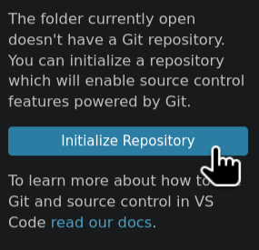
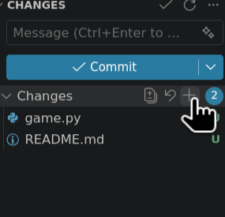
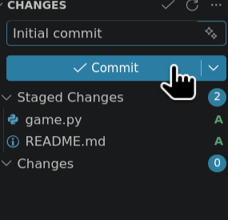
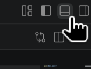
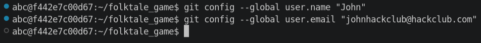
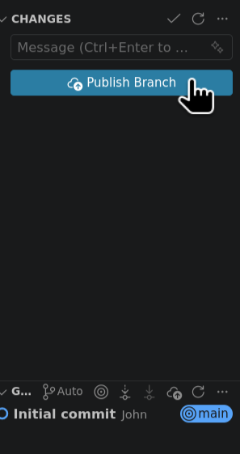
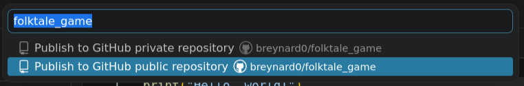
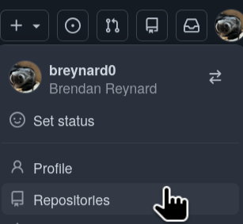
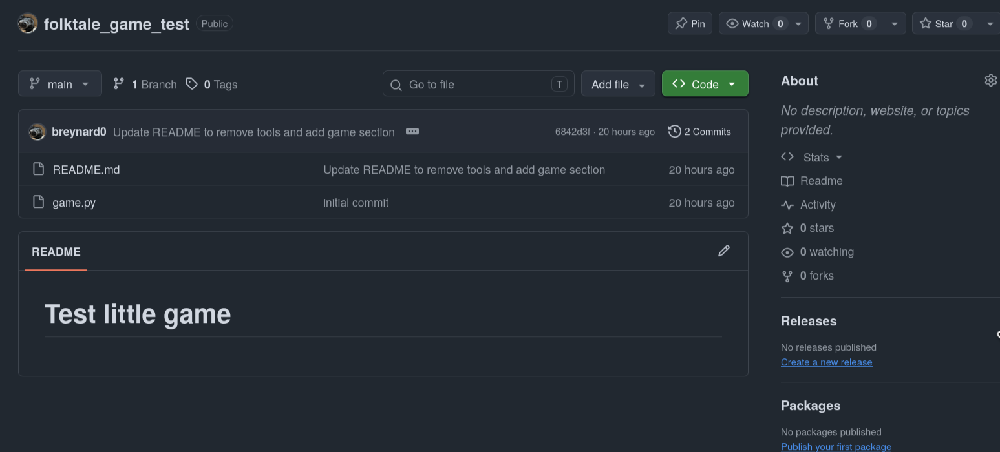

# Submitting your project

The process for submitting a project can differ quite a lot from one You-Ship-We-Ship program to another. For smaller
ones like Folktale, it's often just a submission form.

Before you can submit though, you will have to upload your program to a service like GitHub.

GitHub is a website that is basically social media for programmers. It lets you upload code, manage changes to it, and
find other people's projects.

Go to [GitHub.com](https://github.com) and enter your email to sign up in the big box on the main page. You will be
prompted to fill in some information, verify your email, then you're good to go!

Now, go back into the Hack Club Spaces Visual Studio Code instance. In the left sidebar, click the button with three
dots connected with some lines. This will bring you to the Source Control menu.



Click "Initialize Repository". After you do this, the Source Control panel will change. You will now see a summary of
changes, a message box, and a big button that says "Commit".

GitHub is built on top of a tool called Git. Git is a version control system, which means it tracks changes to the
codebase. Right now, you can just think of it as an extra special save button that publishes your code online. If later
on you are collaborating with others though, Git has a number of really fancy features to allow multiple developers to
work on the same codebase without issues.

There are two sections, Changes and Staged Changes. Changes is where Visual Studio Code sees any sort of change in the
file, and Staged Changes is the changes that are actually going to be included in the commit. For now, make sure all
changes are staged by clicking the '+' button under the Changes view.



Add a message something like "Initial Commit", then click the Commit button.



It's probably going to complain about you missing a username and email. Let's add them.

First, you will have to open the terminal. Trust me, it's not as scary as it sounds, and it is extremely useful in
programming. It's not very intuitive how to do this, it's the button in the top right of your window with the smaller
rectangle on the bottom.



Then, type out these two commands, pressing [Enter] between each one. For the email field, make sure it matches the
email that you used to sign up for GitHub:

```bash
git config --global user.name "YOUR-NAME-HERE"
git config --global user.email "YOUR-EMAIL-HERE"
```



Now, it should let you commit your changes.

After you commit, you will see either a "Publish Branch" or "Sync Changes" button. Click it.



This might prompt you to log in and authorize your GitHub account. Work through the menus.

Afterwards, VSCode will prompt you through publishing your code. Make sure you choose a public repository so Hack Club
can review it.



You should be good to go! Well, almost. Navigate your way to the GitHub repository you just created. If you're on the
main page, you can click your profile picture in the top right then Repositories. It should be right at the top.



On this page, you will see a list of all the files that you pushed. You'll also see underneath the README for the
repository. It's probably the default VS Code Space one. Let's change it.

You can either go back to VS Code or click the pencil icon right on the GitHub page to edit this, found in README.md.
Write up a quick description of your project. Make sure you commit and sync any changes.



Now, you're ready to submit! You can find the submission page
at [https://forms.hackclub.com/folktale](https://forms.hackclub.com/folktale). Note down some information so that we
know who to send stickers to, copy-paste in the repository URL, write up a quick description, mention how you thought
this experience went, and submit!

You will receive your stickers in the mail after your project is reviewed. You can check the status of any inbound mail
at [https://mail.hackclub.com](https://mail.hackclub.com).

Thank you for participating in Folktale! There's one more manual page about where you can go from here.